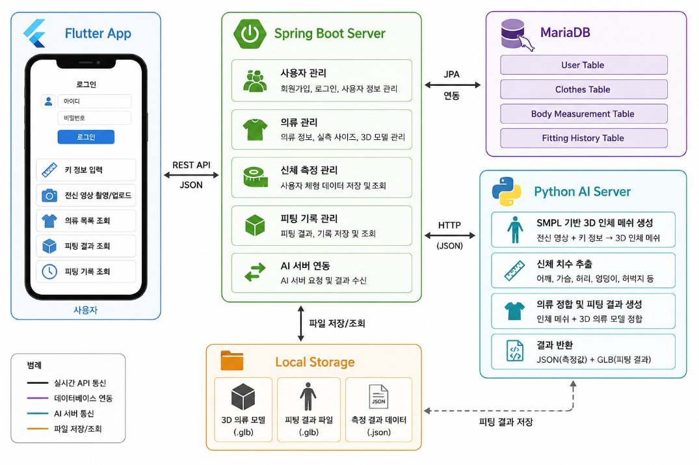

# Fit360 — AI 기반 3D 가상 피팅 & 체형 분석 시스템
> **스마트폰 전신 사진과 실제 키만으로 만드는 개인 맞춤형 3D 가상 피팅 플랫폼**

이 프로젝트는 사용자가 촬영한 전신 사진과 실제 키 정보를 기반으로 **SMPL-X 3D 인체 메쉬**를 생성하고, 의류의 **실측 사이즈와 체형을 비교**하여 착용 가능 여부를 판단한 뒤, 옷을 입힌 **3D 아바타**를 모바일 앱에서 확인하는 가상 피팅 서비스입니다. Python으로 3D 인체 메쉬·신체 치수를 생성하고, Spring Boot로 백엔드 API를, Flutter로 모바일 인터페이스를 구현했습니다.



---

## 프로젝트 선정 배경

### 1. 온라인 의류 구매의 한계
* **직접 착용 불가:** 착용감·기장·여유·체형 적합성을 미리 판단하기 어려움
* **잦은 반품:** 사이즈 선택 실패로 반품·교환이 빈번 → 소비자 불편 + 판매자 물류비 증가
* **환경 부담:** 반복 배송·반품이 포장재 낭비와 의류 폐기물로 이어짐

### 2. 기존 2D 가상 피팅의 한계
* **단순 이미지 합성:** 사진 위에 옷 이미지를 덧씌우는 수준에 머무름
* **입체감 부재:** 옷의 두께·부피, 측면·후면, 체형별 여유 공간을 반영하지 못함
* **치수 미고려:** 어깨·허리·엉덩이 등 실제 신체 치수와의 관계를 판단하지 못함

### 3. 체형 측정 장비의 한계
* **고가 장비 의존:** 정밀 체형 측정에 전용 3D 스캐너가 필요
* **낮은 접근성:** 일반 사용자가 손쉽게 체형을 측정·활용하기 어려움
* **→ 해결:** 스마트폰 촬영만으로 체형 분석 + 가상 피팅을 수행하는 실용적 시스템 제안

<br/>

## Tech Stack (기술 스택)

| 분류 | 기술 |
| :--- | :--- |
| **Frontend** |    |
| **Backend** |      |
| **AI Server** |      |
| **3D** |    |
| **Database** |  |
| **Tools** |     |
| **Collaboration** |    |

<br/>

## 시스템 설계

**[유스케이스 다이어그램]**


**[ERD]**


<br/>

## Project Structure (폴더 구조)

**Frontend(Flutter)**, **Backend(Spring Boot)**, **AI Server(Python)** 가 분리된 모노레포 구조입니다.

```bash
AI-based-3D-Virtual-Fitting/
├── ai-service/              # Python AI 처리 서버 (FastAPI, 포트 8000)
│   ├── main.py              # API 진입점 (/api/fit, /api/job, /api/measurements ...)
│   ├── core/                # 파이프라인 (step1~5, merge_glb, measure_body ...)
│   ├── blender_scripts/     # 헤드리스 Blender 클로스 시뮬레이션
│   ├── clothes/             # 의류 라이브러리 (GLB·썸네일·catalog.json)
│   └── weights/             # SMPL-X 가중치 (별도 다운로드, 저장소 미포함)
│
├── backend/                 # Spring Boot API 서버 (포트 8080)
│   └── src/main/java/.../virtualfitting/
│       ├── domain/{user, clothes, fitting, measurement}/   # 도메인별 계층
│       └── global/{security, error, infra, config}/        # JWT·예외·파일 저장
│
├── frontend/                # Flutter 모바일 앱
│   └── lib/
│       ├── core/            # 공통 API 클라이언트·토큰·설정·상태
│       └── features/{auth, home, clothes, fitting, profile, scan, settings}/
│
└── README.md
```

<br/>

## 주요 기능

### 1. 사진 기반 3D 인체 메쉬 생성
전신 사진 한 장과 실제 키로 개인 맞춤형 3D 아바타를 생성합니다.
* **자세 분석:** MediaPipe로 신체·얼굴 랜드마크 추출
* **체형 피팅:** SMPL-X 파라미터(betas)로 체형 표현, 실제 키로 스케일 보정

### 2. 실측 신체 치수 측정
SMPL-X 메쉬에서 의류 피팅에 필요한 주요 치수를 cm 단위로 추출합니다.
* **측정 항목:** 어깨너비·가슴너비·허리너비·엉덩이너비·허벅지너비·소매길이·밑위
* **활용:** JSON으로 저장해 서버·앱에서 조회 및 착용 판단에 사용

### 3. 가상 피팅 & 착용 가능 여부 판단
* **착용 판단:** 의류 실측 사이즈와 체형 치수를 비교해 가능/불가 표시
* **3D 의류 정합:** Blender 클로스 시뮬로 옷을 인체에 맞추고 단색(대표 색) 적용 후 단일 GLB로 병합
* **기본 의상:** 상·하의 미선택 시 기본 반팔·반바지 자동 착용

### 4. 모바일 앱 & 인증
* **3D 뷰어:** 옷 입은 아바타를 회전·확대하며 확인 (model-viewer)
* **인증:** 이메일/비밀번호 회원가입·로그인 (BCrypt + JWT), 계정별 데이터 격리

## 시연

**[로그인 / 옷 목록 / 피팅 기록]**

  

**[착용 가능 여부 판단]** — 의류 실측 사이즈와 체형을 비교해 착용 가능(좌)/불가(우)를 안내

 

**[3D 피팅 결과]** — 옷 입은 아바타를 회전·확대하며 확인

 

<br/>

## Getting Started (실행 가이드)

### 1. AI Server (FastAPI) 실행
```bash
cd ai-service
python -m venv .venv && .venv\Scripts\activate     # Windows
pip install -r requirements.txt
python main.py
```
> SMPL-X 가중치(`weights/smplx/...`)는 라이선스 자산이라 저장소에 미포함 → [공식 사이트](https://smpl-x.is.tue.mpg.de/)에서 받아 배치. 의류 클로스 시뮬에는 **Blender** 설치 필요. 접속 확인: http://localhost:8000

### 2. Backend (Spring Boot) 실행
```bash
cd backend
gradlew bootRun
```
> MariaDB 실행 필요(스키마는 `ddl-auto=update`로 자동 생성). 환경 변수: `DB_URL`·`DB_USERNAME`·`DB_PASSWORD`, `JWT_SECRET`, `AI_SERVICE_BASE_URL`(내부), `AI_SERVICE_PUBLIC_BASE_URL`(모바일 접근). 접속 확인: http://localhost:8080

### 3. Frontend (Flutter) 실행
```bash
cd frontend
flutter pub get
flutter run
```
> 앱의 "서버 주소 설정" 또는 `lib/core/config/api_config.dart`에서 백엔드 주소 지정 (실기기는 PC의 LAN/핫스팟 IP).

<br/>

## Team Members (팀원 및 역할)

| 이름 | 포지션 | 담당 역할 |
| :--- | :--- | :--- |
| **이승민** (팀장) | Backend | • Spring Boot REST API 서버 설계·구현<br>• 사용자·의류·신체측정·피팅 기록 DB 모델링(JPA)<br>• JWT 인증 & 의류 착용 가능 여부 판단<br>• Flutter ↔ Python AI 서버 데이터 중계 |
| **최예성** | Frontend | • Flutter 모바일 앱 UI/UX 설계·구현<br>• 로그인·키 입력·옷 목록·피팅 기록 화면<br>• GLB 3D 아바타 뷰어 연동<br>• Spring Boot API 연동 |
| **곽동현** | AI | • SMPL-X 기반 3D 인체 메쉬 생성·스케일 보정<br>• 어깨·가슴·허리·엉덩이 등 신체 치수 추출<br>• Blender 클로스 시뮬레이션 의류 정합<br>• JSON·3D(GLB) 결과 출력 |


> 동의대학교 컴퓨터소프트웨어학과 캡스톤 디자인 · 지도교수 권순각 · 피팅팀
