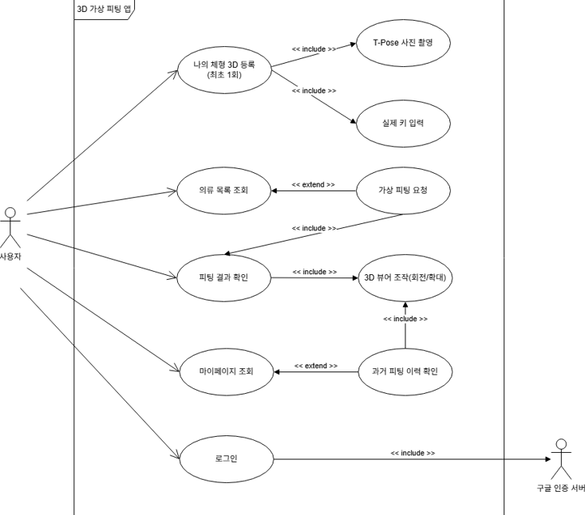
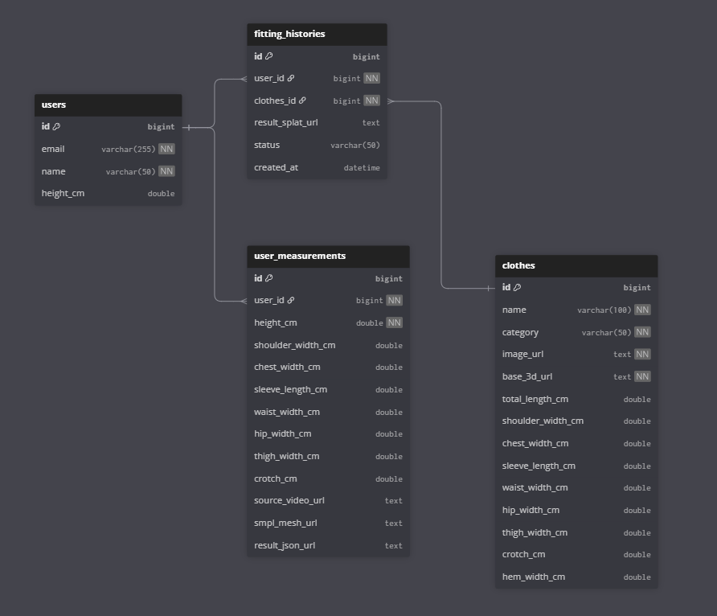
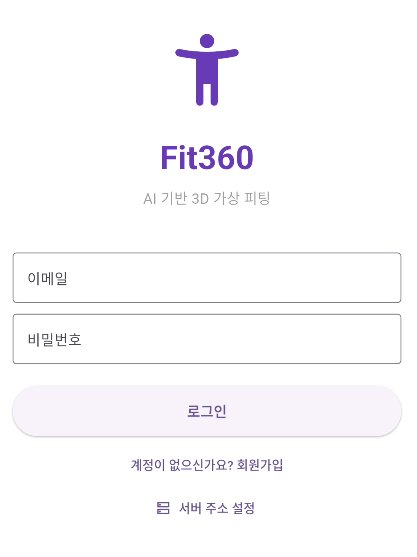
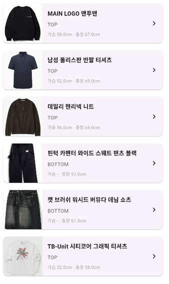
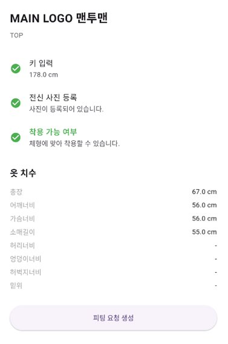
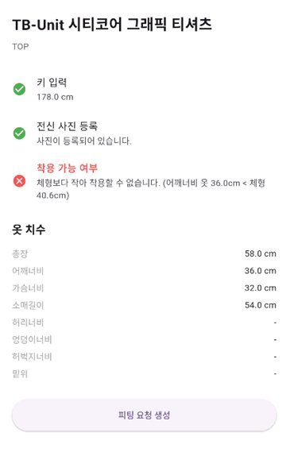
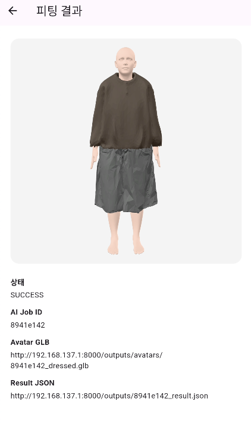
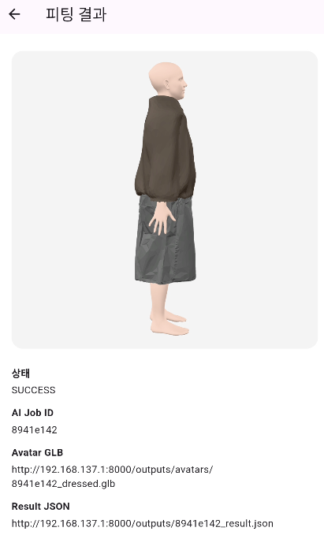

# Fit360 — AI-Based 3D Virtual Fitting & Body Analysis System
> **A personalized 3D virtual fitting platform built from a single full-body smartphone photo and your real height**

This project generates an **SMPL-X 3D human mesh** from a user's full-body photo and real height, compares the garment's **actual measurements and the user's body shape** to determine whether it fits, and lets the user view the clothed **3D avatar** in a mobile app. Python generates the 3D human mesh and body measurements, Spring Boot powers the backend API, and Flutter implements the mobile interface.


---

## Background

### 1. Limitations of Online Clothing Shopping
* **No try-on:** Hard to judge fit, length, ease, and how well a garment suits your body in advance
* **Frequent returns:** Wrong size selection leads to constant returns and exchanges → consumer inconvenience + higher seller logistics costs
* **Environmental burden:** Repeated shipping and returns drive packaging waste and discarded clothing

### 2. Limitations of Existing 2D Virtual Fitting
* **Simple image overlay:** Stays at the level of pasting a clothing image on top of a photo
* **No depth:** Fails to reflect garment thickness/volume, the side and back views, or body-specific ease
* **No measurements:** Cannot evaluate the relationship to actual body dimensions such as shoulders, waist, and hips

### 3. Limitations of Body-Measurement Equipment
* **Dependence on expensive hardware:** Precise body measurement requires dedicated 3D scanners
* **Low accessibility:** Ordinary users cannot easily measure and apply their body data
* **→ Our solution:** A practical system that performs body analysis + virtual fitting from a smartphone photo alone

<br/>

## Tech Stack

| Category | Technology |
| :--- | :--- |
| **Frontend** |    |
| **Backend** |      |
| **AI Server** |      |
| **3D** |    |
| **Database** |  |
| **Tools** |     |
| **Collaboration** |    |

<br/>

## System Design

**[Use Case Diagram]**



**[ERD]**



<br/>

## Project Structure 

 **Frontend (Flutter)**, **Backend (Spring Boot)**, and **AI Server (Python)**.A monorepo with separated

```bash
AI-based-3D-Virtual-Fitting/
├── ai-service/              # Python AI processing server (FastAPI, port 8000)
│   ├── main.py              # API entry point (/api/fit, /api/job, /api/measurements ...)
│   ├── core/                # Pipeline (step1~5, merge_glb, measure_body ...)
│   ├── blender_scripts/     # Headless Blender cloth simulation
│   ├── clothes/             # Clothing library (GLB, thumbnails, catalog.json)
│   └── weights/             # SMPL-X weights (downloaded separately, not in repo)
│
├── backend/                 # Spring Boot API server (port 8080)
│   └── src/main/java/.../virtualfitting/
│       ├── domain/{user, clothes, fitting, measurement}/   # Per-domain layers
│       └── global/{security, error, infra, config}/        # JWT, exceptions, file storage
│
├── frontend/                # Flutter mobile app
│   └── lib/
│       ├── core/            # Shared API client, token, config, state
│       └── features/{auth, home, clothes, fitting, profile, scan, settings}/
│
└── README.md
```

<br/>

## Key Features

### 1. Photo-Based 3D Human Mesh Generation
Creates a personalized 3D avatar from a single full-body photo and the user's real height.
* **Pose analysis:** Extracts body and face landmarks with MediaPipe
* **Body-shape fitting:** Represents body shape via SMPL-X parameters (betas), with scale correction using the real height

### 2. Real Body Measurement
Extracts the key dimensions needed for garment fitting from the SMPL-X mesh, in centimeters.
* **Measured items:** Shoulder width, chest width, waist width, hip width, thigh width, sleeve length, rise
* **Usage:** Saved as JSON for retrieval by the server/app and used in fit decisions

### 3. Virtual Fitting & Fit Decision
* **Fit decision:** Compares the garment's actual measurements against body dimensions to flag fit/no-fit
* **3D garment alignment:** Fits clothing to the body via Blender cloth simulation, applies a solid (representative) color, and merges into a single GLB
* **Default outfit:** When no top/bottom is selected, a default short-sleeve top and shorts are applied automatically

### 4. Mobile App & Authentication
* **3D viewer:** Rotate and zoom the clothed avatar (model-viewer)
* **Authentication:** Email/password sign-up and login (BCrypt + JWT), with per-account data isolation

## Demo

**[Login / Clothing List / Fitting History]**

  

**[Fit Decision]** — Compares garment measurements against body shape to indicate fit (left) / no-fit (right)

 

**[3D Fitting Result]** — Rotate and zoom the clothed avatar

 

<br/>

## Getting Started

### 1. Run the AI Server (FastAPI)
```bash
cd ai-service
python -m venv .venv && .venv\Scripts\activate     # Windows
pip install -r requirements.txt
python main.py
```
> The SMPL-X weights (`weights/smplx/...`) are licensed assets and are not included in the repo → download them from the [official site](https://smpl-x.is.tue.mpg.de/) and place them accordingly. **Blender** is required for the garment cloth simulation. Health check: http://localhost:8000

### 2. Run the Backend (Spring Boot)
```bash
cd backend
gradlew bootRun
```
> MariaDB must be running (the schema is auto-created via `ddl-auto=update`). Environment variables: `DB_URL`, `DB_USERNAME`, `DB_PASSWORD`, `JWT_SECRET`, `AI_SERVICE_BASE_URL` (internal), `AI_SERVICE_PUBLIC_BASE_URL` (mobile access). Health check: http://localhost:8080

### 3. Run the Frontend (Flutter)
```bash
cd frontend
flutter pub get
flutter run
```
> Set the backend address in the app's "Server Address Settings" or in `lib/core/config/api_config.dart` (use your PC's LAN/hotspot IP for physical devices).


<br/>

## Team Members & Roles

| Name | Position | Responsibilities |
| :--- | :--- | :--- |
| **Lee Seungmin** (Lead) | Backend | • Design & implementation of the Spring Boot REST API server<br>• DB modeling for users, clothing, body measurements, and fitting history (JPA)<br>• JWT authentication & garment fit decision logic<br>• Data relay between Flutter ↔ Python AI server |
| **Choi Yeseong** | Frontend | • Design & implementation of the Flutter mobile app UI/UX<br>• Login, height input, clothing list, and fitting history screens<br>• GLB 3D avatar viewer integration<br>• Spring Boot API integration |
| **Kwak Donghyun** | AI | • SMPL-X-based 3D human mesh generation & scale correction<br>• Extraction of body dimensions (shoulders, chest, waist, hips, etc.)<br>• Garment alignment via Blender cloth simulation<br>• JSON & 3D (GLB) result output |


> Dong-eui University, Dept. of Computer Software · Capstone Design · Advisor: Prof. Kwon Soon-gak · Fitting Team
